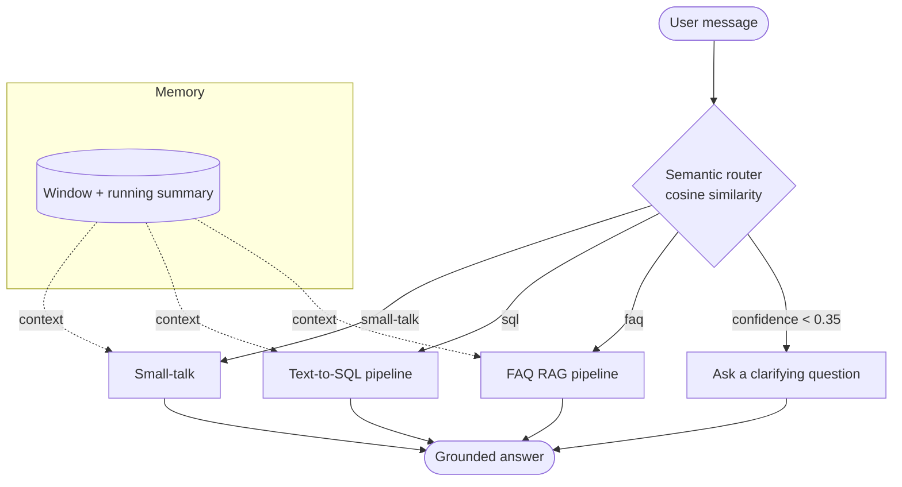
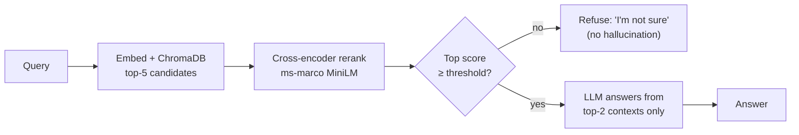
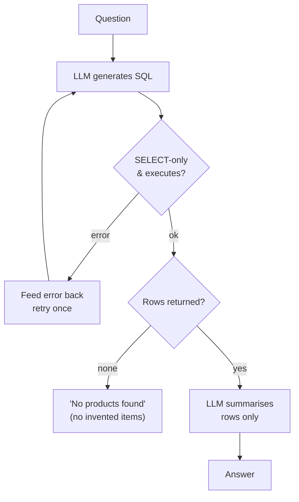

# 🛍️ E-Commerce Chatbot — RAG + Text-to-SQL with anti-hallucination guardrails


A grounded shopping assistant for an e-commerce catalog. It classifies each
message into an intent and answers it from a **real data source** — never from
the model's imagination:

- **FAQ** → retrieval-augmented answers over a store-policy knowledge base
- **SQL** → live text-to-SQL queries against the product catalog
- **Small-talk** → short, on-brand chit-chat

The focus of this project is **measurably reducing LLM hallucination**:
cross-encoder reranking + corrective-RAG gating, self-correcting SQL, a router
confidence gate that asks clarifying questions, and an **evaluation harness**
that turns "feels better" into numbers.

---

## Architecture



### FAQ pipeline — retrieve → rerank → corrective-RAG gate



### SQL pipeline — generate → validate → self-correct



---

## Why this is more than a basic chatbot

| Problem in the original POC | Fix in this version |
| --- | --- |
| Always answered FAQs even when retrieval was irrelevant | Cross-encoder rerank + **corrective-RAG gate** (refuse below threshold) |
| SQL chain invented products on empty results | Explicit "no products found" + **SELECT-only** validation |
| One bad query = dead end | **Self-correcting** retry that feeds the SQL error back to the model |
| Router guessed on ambiguous input | **Confidence gate** → asks a clarifying question |
| No conversation context | **Memory layer** (window + running summary) for follow-ups |
| No way to know if it works | **Eval harness** with routing accuracy, grounding rate, SQL success, latency |
| Hardcoded API key in source | Env-based config + `.env.example`, key never committed |
| Notebook-based, irreproducible data | One-command **`build_db.py`** pipeline + `category` schema |
| No tests / CI / deploy | **pytest + ruff + GitHub Actions** and a **Dockerfile** |

---

## Metrics

Run the offline evaluation against the labeled golden set:

```bash
python eval/evaluate.py
```

It writes `eval/reports/report.json` and `eval/reports/metrics.png`:

- **Routing accuracy** — predicted intent vs. labeled intent
- **Grounding rate** — answers that contain the expected facts (faithfulness proxy)
- **SQL success rate** — share of product queries that execute and return usable rows
- **Avg latency** — per-query wall-clock time

---

## Tech stack

`Streamlit` · `Groq (gpt-oss-120b)` · `ChromaDB` · `sentence-transformers`
(bi-encoder retrieval + cross-encoder rerank) · `SQLite` · `pytest` · `ruff`
· `GitHub Actions` · `Docker`

## Project structure

```
app/        chatbot: router, faq, sql, smalltalk, memory, llm, config
data/       build_db.py — reproducible CSV → SQLite pipeline
eval/       golden_dataset.json + evaluate.py (metrics + charts)
tests/      unit + smoke tests (no API key needed)
.github/    CI workflow
```

---

## Setup & run

1. Install dependencies:
   ```bash
   pip install -r requirements.txt
   ```
2. Add credentials — copy the template and fill in your Groq key:
   ```bash
   cp .env.example app/.env   # then edit app/.env
   ```
   Get a free key at <https://console.groq.com/keys>.
3. Build the catalog database from the CSV:
   ```bash
   python data/build_db.py
   ```
4. Run the app:
   ```bash
   streamlit run app/main.py
   ```

### Run with Docker

```bash
docker compose up --build   # reads GROQ_API_KEY from your environment
```

### Run the tests

```bash
pip install -r requirements-dev.txt
pytest -q
```
