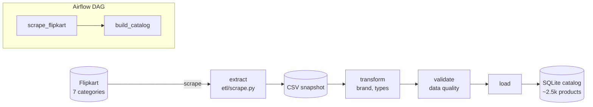
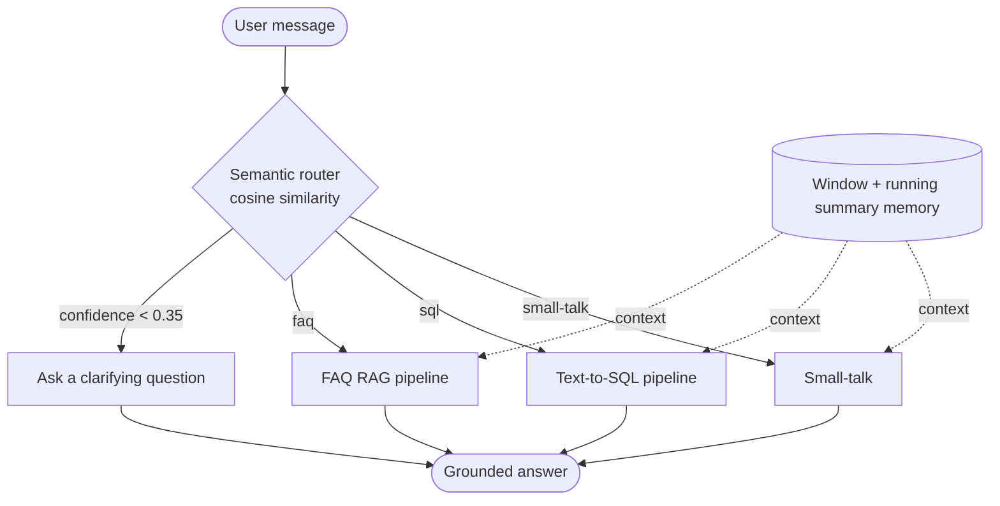
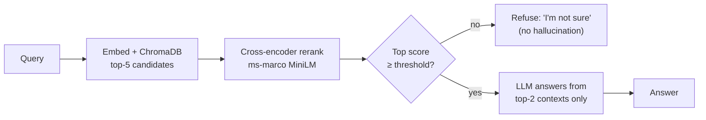
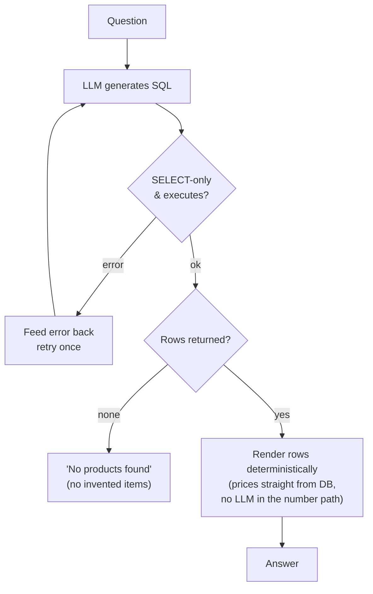

# 🛒 Saarthi — Flipkart Electronics Chatbot

> *Saarthi* (सारथी) means "guide / charioteer" — your guide to Flipkart electronics.
> A grounded RAG + Text-to-SQL assistant with an Airflow-orchestrated ETL pipeline.


A grounded shopping assistant for an Indian electronics catalog (mobiles,
laptops, headphones, smartwatches, televisions, tablets, earbuds). Product data
is scraped from Flipkart by an **Airflow-orchestrated ETL pipeline**, and the
chatbot answers every question from a **real data source** — never from the
model's imagination:

- **FAQ** → retrieval-augmented answers over a store-policy knowledge base
- **SQL** → live text-to-SQL queries against the product catalog
- **Small-talk** → short, on-brand chit-chat

The two themes of this project are **measurably reducing LLM hallucination** and
**a reproducible data pipeline**:
cross-encoder reranking + corrective-RAG gating, self-correcting SQL, a router
confidence gate that asks clarifying questions, an **evaluation harness** with an
LLM-as-judge faithfulness metric, and an **ETL pipeline** (Airflow) that keeps
the catalog fresh.

---

## Data pipeline (ETL, orchestrated by Airflow)



The real work lives in the framework-agnostic `etl/` package, so the pipeline is
unit-testable and runs **with or without Airflow**. Airflow just schedules it and
gives a visual task graph. The scrape is snapshotted to a CSV so CI and the app
never depend on a live scrape.

## Chatbot architecture



### FAQ pipeline — retrieve → rerank → corrective-RAG gate



### SQL pipeline — generate → validate → self-correct



> **Prices are guaranteed correct.** The result list is formatted in Python
> directly from the query rows, so every price/discount/rating shown is exactly
> what's in the database — the LLM never transcribes a number. This also drops an
> LLM call, so SQL answers are faster and cheaper.

---

## Why this is more than a basic chatbot

| Problem in the original POC | Fix in this version |
| --- | --- |
| One product category, notebook-loaded | **7-category ETL pipeline** scraping ~2.5k live Flipkart products |
| No orchestration | **Airflow DAG** (scrape → build) with the logic in a testable `etl/` package |
| Always answered FAQs even when retrieval was irrelevant | Cross-encoder rerank + **corrective-RAG gate** (refuse below threshold) |
| SQL chain invented products on empty results | Explicit "no products found" + **SELECT-only** validation |
| One bad query = dead end | **Self-correcting** retry that feeds the SQL error back to the model |
| Router guessed on ambiguous input | **Confidence gate** → asks a clarifying question |
| No conversation context | **Memory layer** (window + running summary) for follow-ups |
| No way to know if it works | **Eval harness**: routing accuracy, LLM-as-judge faithfulness, SQL success |
| Hardcoded API key in source | Env-based config + `.env.example`, key never committed |
| No tests / CI / deploy | **pytest + ruff + GitHub Actions**, deployed on **Streamlit Cloud** with a **daily auto-refresh** |

---

## Metrics

Run the offline evaluation against the labeled golden set:

```bash
python eval/evaluate.py     # writes eval/reports/report.json and metrics.png
```

- **Routing accuracy** — predicted intent vs. labeled intent
- **Faithfulness** — LLM-as-judge: is the answer supported by the retrieved context?
- **Grounding rate** — keyword check that expected facts appear
- **SQL success rate** — product queries that execute and return usable rows
- **Avg latency** — per-query wall-clock time

---

## Tech stack

`Streamlit` · `Groq (gpt-oss-120b)` · `ChromaDB` · `sentence-transformers`
(bi-encoder retrieval + cross-encoder rerank) · `SQLite` · `Flipkart scraping
(requests + BeautifulSoup)` · `Apache Airflow` · `pytest` · `ruff`
· `GitHub Actions (CI + scheduled refresh)` · `Streamlit Community Cloud`

## Project structure

```
app/        chatbot: router, faq, sql, smalltalk, memory, llm, config
etl/        scrape.py + extract/transform/validate/load + pipeline.py
airflow/    dags/ + README (run with `airflow standalone`, no Docker)
eval/       golden_dataset.json + evaluate.py (metrics + charts)
tests/      unit + smoke tests (no API key needed)
.github/    CI workflow + daily data-refresh workflow
```

---

## Setup & run

1. Install dependencies:
   ```bash
   pip install -r requirements.txt
   ```
2. Add credentials — copy the template and fill in your Groq key:
   ```bash
   cp .env.example app/.env   # then edit app/.env
   ```
   Get a free key at <https://console.groq.com/keys>.
3. Run the app (it builds the catalog DB from the committed snapshot on first run):
   ```bash
   streamlit run app/main.py
   ```
   To refresh the snapshot from Flipkart first:
   `pip install -r requirements-dev.txt && python -m etl.scrape --pages 20`

### Run the tests

```bash
pip install -r requirements-dev.txt
pytest -q
```

### Run the ETL in Airflow (local, no Docker)

See [`airflow/README.md`](airflow/README.md) — `pip install apache-airflow` then
`airflow standalone`.

---

## Deployment & daily refresh

**Deploy (Streamlit Community Cloud):** point it at this repo with
`app/main.py` as the entry file, and add `GROQ_API_KEY` (and optionally
`GROQ_MODEL`) under the app's **Secrets**. The app builds its own database on
startup, so there is no separate build step. Every push to `main` auto-redeploys.

**Daily refresh (tiered + idempotent):** a **daily shallow** scrape at 00:00 IST
([`refresh-data.yml`](.github/workflows/refresh-data.yml), top pages where prices
move) and a **weekly deep** scrape
([`refresh-data-weekly.yml`](.github/workflows/refresh-data-weekly.yml), new
products). Both **upsert by `product_link`** — re-scraped items update in place,
new items are added, and identical data produces a byte-identical CSV, so a
commit (and redeploy) only happens when something actually changed. If a scrape
is throttled, the last good snapshot is kept.


The Airflow DAG schedules the same pipeline and is the orchestration showcase;
the cron is what actually runs daily without an always-on server.
